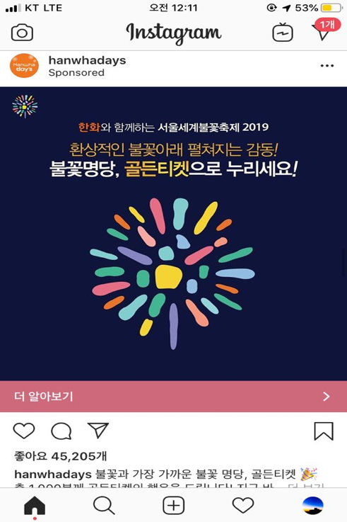
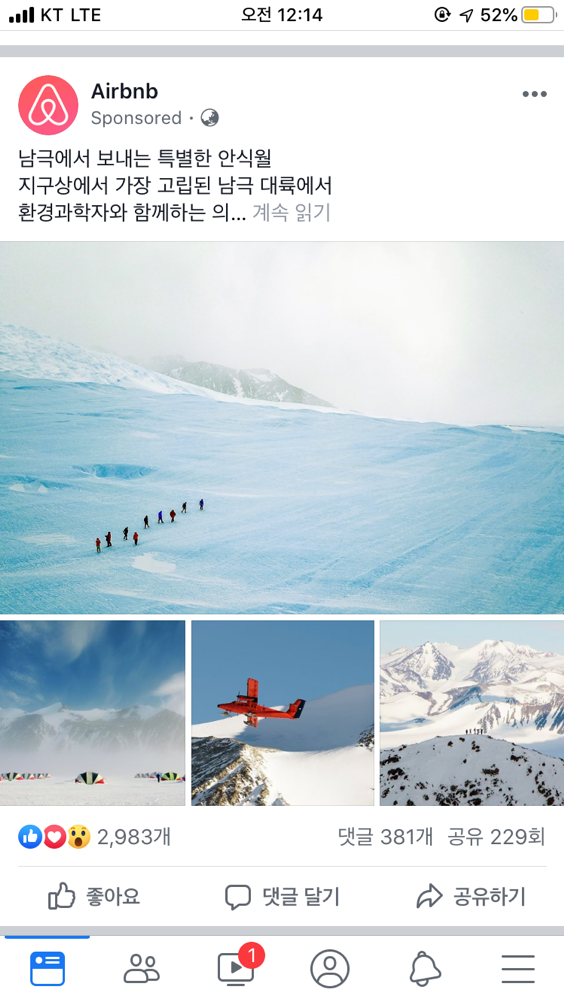
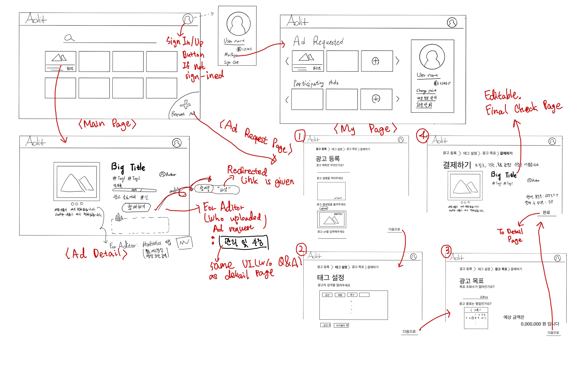
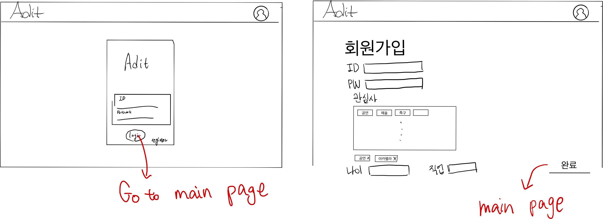

# Team 21 - Sprint 1
## Project abstract
 Adit is an advertiser-participant matching platform that implements crowd sourcing system. For convenience, we define advertisers as ‘Aditors’, ad participants as ‘Aditees’. Aditors would post a link which he/she wants to promote, and a number of aditees will freely participate in that advertisement with provided link. Aditors can submit ad requests by setting their own target inflow to promotional sites and advertising duration. Their expenses are calculated based on their target inflow and charged right after submission. Aditees will be given a unique link to evaluate their paticipation and compensated according to their contribution. Inflow rate to the promotional site would be notified to aditors since submission. In case their goal is not achieved after due date, aditors get refund on the difference between used and paid. Aditees can collect rewards and cash in them with continuous participation, which can contribute to ongoing involvement. On this system anyone can be an advertiser and anything can be advertised, ranging from product promotions to club performance notices. This will also push the limits of advertiser of as and its participants, suggesting new paradigm of ‘Advertisement Open For Everyone’.

## Customer
- **General Customer**
    - Aditor
        - All people who want to inform or promote something
    - Aditee
        - All people who can use the internet
- **Specific Customer**
    - Aditor
        - People who want to inform or promote something with **simple procedure** and **small payment**.
    - Aditee
        - People who want to earn little money with **little effort** & people who want to with their their professional knowledge, and get rewards for it.

---
## Competitive Landscape
#### Target Market
- Social Media Advertising Market
#### Market Competitors
- **Sponsor Ads** which is serviced by social media platform itself
    - _e.g. Sponsor-ads of Facebook, Instagram..._
    - 
    - 
- **Social Influencer Marketing Platform**
    - _e.g. BuzzWeb, BuzzSumo, NinjaOutreach..._
- **Google Adsense**
#### Our Difference
- **Who can request Ads?**
    - Clients of Google Adsense or traditional marketing agency are usually those who are desiring to sell products on open market, or enhance their brands’ images. Social media sponsor ads offer clients to suggest events, organizations, or social movements to people via their platform. The appearance of these platforms has significantly expanded the pool of advertisers. However, small groups still cannot request Ads to those who distribute them due to financial burden and complex procedures. Our platform, Adit, is open for all, and especially targets those who used to promote their products by not really public ways : Kakaotalk, own posters… etc. Anyone who wants to promote their club recruitment, performances, or even home party can use Adit platform.

- **Who spreads Ads?**
    - Traditional field players spread their Ads by macro spreader like social media Influencers or Ad boxes on website(mobile application). By directly connecting advertisers and spreaders, we can enable micro spreader like friends, acquaintances, professionals, people in everyday life to spread Ads. Traditional macro spreaders can also expose Ads through Adit. This property enables Ad exposure to ‘small, intensive’ groups of people.

- **How Ads are spread?**
    - Google Adsense, Social media sponsored ads’ information exposure ways are quite unidirectional. Ads provided by platforms or their own algorithms, people are forced to be exposed to a flood of ads that are shown in a ‘strictly calculated’ manner. Adit uses another way, using one’s own acquaintances and taking method of personal suggestion. Ad participants share informations to their friends, colleagues, or family members, so that they can receive information in the form of their acquaintances' suggestions.

---
## User Stories
#### 1. Aditors who want to request Ads - [sprint 3]
- **Feature name**
    * Submit Ad request
- **Actor(s)** 
    * Aditors(those who want to promote something)
- **Preconditions** (in what system state is this user story applicable) 
    * The aditor has to be a registered user and logged in
- **Triggers** (what initiates the story)
    * The aditor clicks button directed to ‘submit-ad-request-action’.
- **Scenario** 
    * The page asks about ad’s expiration date, the goal of views, Ad title, Ad content, Ad URL, Ad thumbnail, Ad-related-hashtag.
    * In the end, the page displays the preview of the article with a confirm button.
- **Postconditions** (what is the system state after the story is done) 
    * DB -> insert Item created by Aditor
    * User Screen -> Directed to the page that Aditor requested to upload.
- **Exceptions**
    * Aditor doesn’t have enough points to request his/her target number of views.
- **Acceptance tests**
    * After typing his/her goal number of views and due date, aditor can submit request only after that his / her residual point is verified to be larger than costs for their goal view.
    * Only after choosing 3 ad-related hashtags aditor can submit request.
    * User should fill out all the required fields - Title, Content, Image. After entering all the session, checking preview and paying points aditors should see “Successfully submitted”.

#### 2. Aditees who want to participate in particular Ad - [sprint 4]
* **Feature name**
    * Get Ad links
* **Actor(s)**
    * Aditees(those who want to participate in sharing ads)
* **Preconditions**
    * The aditee has to be a registered user and logged in.
    * The ads should not be expired.
* **Triggers**
    * The aditee clicks “Participate” button
* **Scenario**
    * Page shows aditee “Participate” button
    * Aditee click the button
    * The page returns the link.
* **Postconditions**
    * User cannot participate the ad that he/she already did.
* **Exceptions**
    * None
* **Acceptance tests**
    * For aditees who already clicked ‘participate’ button for certain ad request, he or she should see not a button, but one’s own url for sharing in that ad request’s detail page.

#### 3. Aditees who want to be paid for their contributions to Ad - [sprint 4]
- **Feature name**
    - Ad rewards
- **Actor(s)**
    - Aditees participated for the Ad
- **Preconditions**
    - Meet goal of views || Today > Expiration of date
- **Triggers**
    - (Auto) If preconditions met
- **Scenario**
    - Calculate one’s share of cash point by (points per views) X (number of generated inflow via their own urls)
- **Postconditions**
    - Aditee’s personal point increases by the amount as calculated. 
- **Exceptions**
    - None
- **Acceptance tests**
    - Aditees can only get their earned points after the due date of ad request they worked for.

#### 4. Aditors who want to modify his/her Ad request - [sprint 5]
- **Feature name**
    - Modify ad request
- **Actor(s)**
    - Aditor who wrote article that want to modify his/her ad.
- **Preconditions**
    - The ads should be requested by the Aditor
- **Triggers**
    - User clicks “Modify” button
- **Scenario**
    - The page displays all the modifiable contents so that user can modify those.
    - Expiration date, goal number of view not allowed to modify : only title, contents, images are modifiable. 
- **Postconditions**
    - Article update.
- **Exceptions**
    - Aditors revise requests and try to submit with one of three fields - title, contents, images - empty.
- **Acceptance tests**
    - After aditor changing title, contents, and images, none of the three should be an empty field in order to post modifications.
    - Only the person who submitted the ad request can access to modification page of that request.

#### 5. Aditors who want to get a refund on the ramaining views - [sprint 5]
- **Feature name**
    - Point refund
- **Actor(s)**
    - Aditors of the ad.
- **Preconditions**
    - The ad should have been expired before reaching its goal.
- **Triggers**
    - Ad request expiration
- **Scenario**
    - (Auto) Points will be refunded the day after ad expiration.
- **Postconditions**
    - Aditors of that ad request would be notified by certain alert and see one’s point increased by the difference.
- **Exceptions**
    - If the aditor has withdrawn before ad expiration, left point will disappear. 
- **Acceptance tests**
    - After aditor’s ad has been expired, he/she’s point wallet’s balance’s difference should be exactly same as the left point of the ad.

#### 6. Aditees who have a question of particular Ad request - [sprint 6]
- **Feature name**
    - Q&A
- **Actor(s)**
    - Aditees who have questions of certain ad request.
- **Preconditions**
    - The aditee should be registerd in.
- **Triggers**
    - The aditee clicks Q&A section.
- **Scenario**
    - Aditee can write some questions through a panel.
    - When aditee hits submit button, the question will be posted.
- **Postconditions**
    - The question that Aditee asked should be posted.
- **Exceptions**
    - Either the title or content is empty when the Aditee hits submit button.
- **Acceptance tests**
    - Only after filling up all two fields(title, contents) can an aditee post one’s question.

#### 7. Aditors who want to answer Aditees' question about Ad request - [sprint 6]
- **Feature name**
    - Q&A
- **Actor(s)**
    - Aditors who wants to answer to questions posted by aditees.
- **Preconditions**
    - There are questions for his/her certain ad request.
- **Triggers**
    - Aditors clicks ‘Answer’ button.
- **Scenario**
    - Aditor can reply to the question through a panel.
    - When aditor hits submit button, the answer will be posted.
- **Postconditions**
    - The answer that aditor made should be posted under related question.
- **Exceptions**
    - Contents of one’s reply is empty when the Aditor hits submit button.
- **Acceptance tests**
    - Only after filling up contents can an aditor post one’s answer.

#### 8. Users who want to sign up on _Adit_ - [sprint 2]
- **Feature name**
    - Sign up
- **Actor(s)**
    - Those who wants to sign up
- **Preconditions**
    - None
- **Triggers**
    - The user clicks _Sign up button_
- **Scenario**
    - The user fills in ID, password, tags related to interests, age, job.
    - When the user hits submit button, the user will be registered
- **Postconditions**
    - The user can sign in to _Adit_.
- **Exceptions**
    - Entered ID or password didn’t pass verification test : not unique ID, not satisfying security conditions.
    - User didn’t fill up all fields and try to sign up.
- **Acceptance tests**
    - Only after filling up the fields can the users sign in.
    - If there is any field that is not filled in, the user cannot register.

#### 9. Users who want to sign in - [sprint 2]
- **Feature name**
    - User login
- **Actor(s)**
    - Registered User
- **Preconditions**
    - User has not signed in.
- **Triggers**
    - User clicks “Sign In” button
- **Scenario**
    - User input his/her ID, password
    - User click sign-in button.
- **Postconditions**
    - User is signed in.
- **Exceptions**
    - There is no matching ID and password.
- **Acceptance tests**
    - When user inputs not matching ID and password, user should input ID and password again with _ID or password not matching_

#### 10. Aditees who want to search Ad requests with tags - [sprint 3]
- **Feature name**
    - Search Ad requests with tags
- **Actor(s)**
    - Aditees
- **Preconditions**
    - None
- **Triggers**
    - User 
- **Scenario**
    - User click search icon
    - User select tags
    - Start search of selected tags
    - Ad requests with selected tags are shown by list
- **Postconditions**
    - None
- **Exceptions**
    - None
- **Acceptance tests**
    - Backend testing, backend server should return list of Ad requests with selected tags when tags are entered
---
## UI Design

