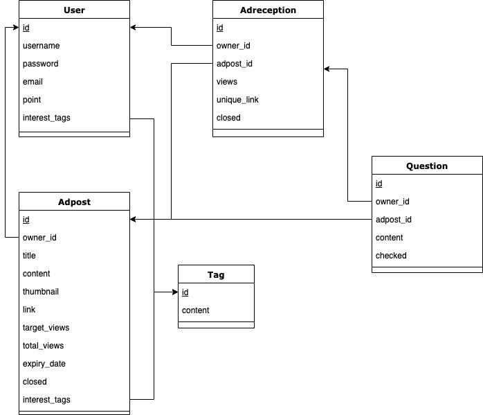
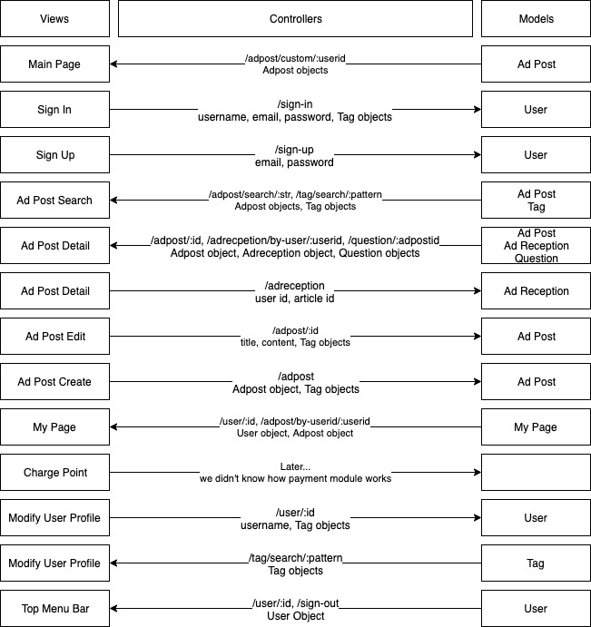
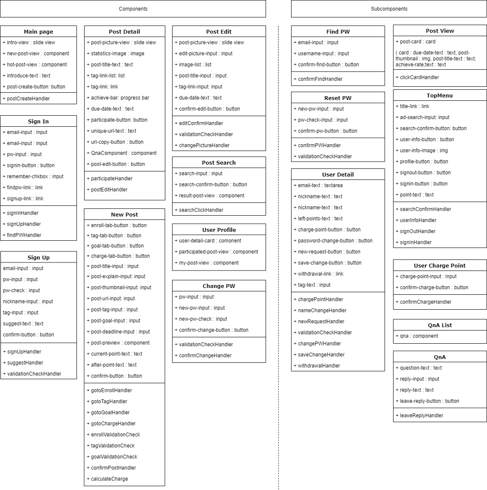
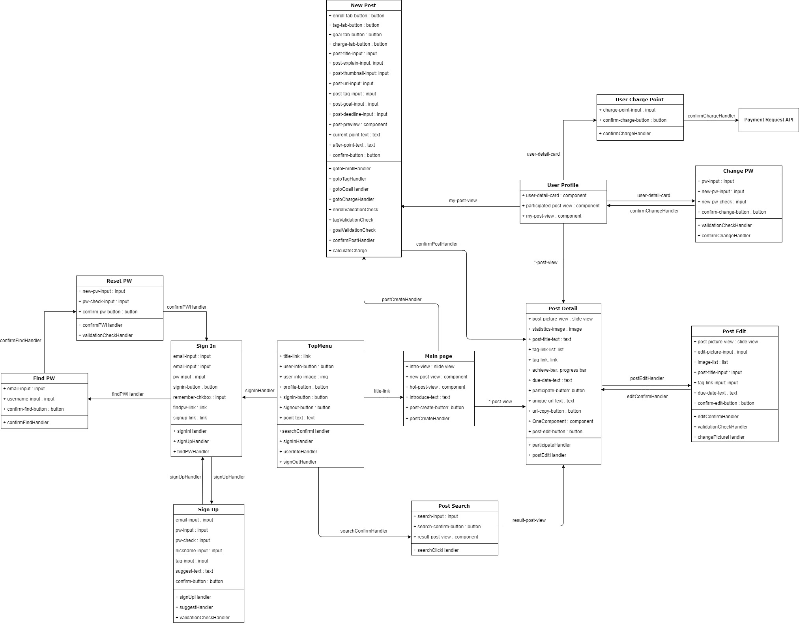

# Team 21 - Sprint 2
## Design and Planning Document
> 2018-15366 Sangmin Kim
> 2018-13132 Yeongho Seo
> 2018-18761 Donghyun Son
> 2018-11940 Seonghwan Choi

## System Architecture

> We descript our system architecture using MVC design pattern

#### Models

#### Views

- `/sign-up` **sign-up page**
  - Sign up a new user
  - Get ‘username’, ‘password’, ‘user-email’, ‘tag-list’ as user input
- `/sign-in` **sign-in page**
  - Sigin in
  - Can be redirected to **sign-up page**
- `/` **main page**
  - Show Ad post item lists
  - There are 2 or more lists _Hottest_, _Interested Tag 1_, _Interested Tag 2_…
  - Each list shows Ad posts that are involved in each list titles
  - Get ‘search statement’ as input
  - Each Ad post item contains thumbnail, title, achievement of Ad & when clicked, navigate to the **adpost-detail page**
- `/adposts/:id` **adpost-detail page**
  - Show the content, title, image, owner, expiry date of Ad post
  - Additional UI for the owner of Ad post (Aditor)
    - shows analytics window which contains a graph of daily views
    - shows 'ad-edit-button'
    - If the user clicks the ‘edit’ button, navigate to the **adpost-edit page**.
  - Additional UI for Aditees
    - shows ‘ad-accept-button’
    - If the user clicks ‘cancel’ button, navigate to the **main page**
- `/adposts/create` **adpost-create page**
  - Create(request) an Ad post
  - It contains 4 tab layout
    - First, tab need title, content, thumbnail, URL of Ad as input
    - Second, select tag related to Ad
    - Third, set goal of Ad
    - Last, pay through pay module
  - Successfully add Adpost, navigate to **adpost-detail page**
- `/adposts/:id/edit` **adpost-edit page**
  - UI similar to **adpost-detail page**
  - But post title, contents can be modified by user input
- `/adposts/search=:str` **search-result page**
  - Show Ad post items which are matched by 'str'
  - Each Ad post item contains thumbnail, title, achievement of Ad & when clicked, navigate to the **adpost-detail**
- `/mypage` **user-info page**
  - Show user info window which contains user name, email, interesting tags, points, etc..
  - Show Ad post list which user is participating
  - Show Ad post list which user owns
  - If the user clicks the 'charge' button, navigate to the **charge-point page**
- `/mypage/:userid/charge` **charge-point page**
  - Get 'cash want to charged' as user input
  - If the user clicks the 'confirm' button, redirected to external billing module page
- `/mypage/:userid/modify-profile` **modify-profile page**
  - Show user info window which contains user name, email, interesting tags
  - User can modify user name, email, interesting tags with user input

#### Controller

---

## Design Details

### Front-end Design

#### Front-end Component

#### Front-end Algorithm

- **Main page**

  - `postCreateHandler`: when ‘post-create-button’ is clicked, it redirects users to **New Post**.
  - `searchConfirmHandler`: when ‘search-confirm-button’ is clicked, it gets relevant posts from `/backend/adpost/search/:str` and redirects users to **Post Search**.

- **Post Detail**

  - `participateHandler`: when ‘participate-button’ is clicked, it posts users’ information including one’s own link to `/backend/adreception`.
  - `postEditHandler`: when ‘post-edit-button’ is clicked, it redirects user to **Post Edit**.

- **Sign In**

  - `signInHandler`: when ‘signin-button’ is clicked, it posts users’ log in information to `/backend/sign-in` using user id and redirects user to **Main Page** when id and password are correct.
  - `signUpHandler`: when ‘signup-link’ is clicked, it redirects users to **Sign Up**.
  - `findPWHandler`: when ‘findpw-link’ is clicked, it redirects users to **Find P**.

- **Sign Up**

  - `signUpHandler`: when ‘confirm-button’ is clicked, it posts users’ information to `/backend/sign-up` and redirects users to **Sign In**.
  - `suggestHandler`: when value of ‘tag-input’ is changed, it gets relevant tags from `/backend/tag/search/:pattern` and updates value of ‘suggest-text’.
  - `validationCheckHandler`: when value of inputs are changed, it checks whether all inputs are valid.

- **Post Edit**

  - `editConfirmHandler`: when ‘confirm-edit-button’ is clicked, it posts edited post to `/backend/adpost` and redirects users to **Post Detail**.
  - `validationCheckHandler`: when value of inputs are changed, it checks whether all inputs are valid.
  - `changePictureHandler`: when ‘edit-picture-input’ is clicked, it enables users to upload image via pop-up.

- **Post Search**

  - `searchClickHandler`: when ‘search-confirm-button’ is clicked, when ‘search-confirm-button’ is clicked, it gets relevant posts from `/backend/adpost/search/:str`

- **User Detail**

  - `chargePointHandler`: when ‘chare-point-button’ is clicked, it redirects users to **Charge Point**.
  - `nameChangeHandler`: when ‘email-text’ is changed, it changes state of react components
  - `newRequestHandler`: when ‘new-request-button’ is clicked, it redirects users to **New Post**.
  - `saveChangeHandler`: when ‘save-change-button’ is clicked, it puts modified user detail to `/backend/users/:id`.
  - `validationCheckHandler`: when values of inputs are changed, it checks user input matches syntax and notice it by color of text.
  - `changePWHandler`: when ‘password-change-button’ clicked, it prompts users to input current password and check correctness, then accepted, it takes new-password through prompt window and puts new password to backend server through `/backend/user/:id`.
  - `withdrawallHandler`: when ‘withdrawalll-link’ is clicked, it redirects users to **Withdrawall**.

- **TopMenu**

  - `postCreateHandler`: when ‘post-create-button’ is clicked, it redirects users to **New Post**.
  - `userInfoHandler`: when ‘user-info-button’ is clicked, it redirects users to **User Detail**.
  - `signOutHandler`: when ‘signout-button’ is clicked, it requests GET `backend/sign-out` to backend, then redirects users to **Main Page**.

- **Change PW**

  - `validationCheckHandler`: when ‘new-pw-input’ or ‘new-pw-check’ are changed, it checks user inputs match syntax and notice it by color of text
  - `confirmChangeHandler`: when ‘confirm-change-button’ is clicked, it checks if ‘pw-input’ match user’s current password and if ‘new-pw-input’ equals to ‘new-pw-check’. If all satisfied, put changed password to backend server through `/backend/user/:id`.

- **Find PW**

  - `confirmFindHandler`: when ‘confirm-find-button’ is clicked, it checks if user exists whose email matches ‘username-input’s’ value. If checking satisfied,

- **PreviewGrid**

  - `clickPreviewHandler`: when ‘Preview’’ is clicked, it redirects users to corresponding **Post Detail**.

- **User Charge Point**

  - `confirmChargeHandler`: when ‘confirm-charge-button’ is clicked, it provides pop-up to help users’ payment.

- **QnA**
  - `leaveReplyHandler`: when ‘leave-reply-button’ is clicked, it posts qna to `/backend/question` and redirects users to **Post Detail**.

#### Front-end Relation

### Backend Design

| Model           | API                            | GET                                                     | POST                   | PUT                   | DELETE |
| --------------- | ------------------------------ | ------------------------------------------------------- | ---------------------- | --------------------- | ------ |
| **User**        | `/sign-up`                     | X                                                       | Create new user        | X                     | X      |
|                 | `/sign-in`                     | X                                                       | Log in                 | X                     | X      |
|                 | `/sign-out`                    | Log out                                                 | X                      | X                     | X      |
|                 | `/user/:id`                    | Get specific user                                       | X                      | Edit specified user   | X      |
| **Adpost**      | `/adpost`                      | X                                                       | Create new adpost      | X                     | X      |
|                 | `/adpost/:id`                  | Get specified adpost                                    | X                      | Edit specified adpost | X      |
|                 | `/adpost/by-userid/:userid`    | Get adpost list by userid                               | X                      | X                     | X      |
|                 | `/adpost/by-tag/:tag`          | Get adpost list by tag                                  | X                      | X                     | X      |
|                 | `/adpost/hottest`              | Get adpost list by popularity                           | X                      | X                     | X      |
|                 | `/adpost/recent`               | Get adpost list by uploaded time                        | X                      | X                     | X      |
|                 | `/adpost/search/:str`          | Get adpost list by string query                         | X                      | X                     | X      |
|                 | `/adpost/custom/:userid`       | Get adpost list by user's tags                          | X                      | X                     | X      |
| **Adreception** | `/adreception`                 | X                                                       | Create new adreception | X                     | X      |
|                 | `/adreception/:id`             | Get specified adreception                               | X                      | Increase Ad views     | X      |
|                 | `/adreception/by-user/:userid` | Get adreception list by user & update close/open adpost | X                      | X                     | X      |
| **Tag**         | `/tag`                         | X                                                       | Create new tag         | X                     | X      |
|                 | `/tag/search/:pattern`         | Get list of tags which start with 'pattern'             | X                      | X                     | X      |
| **Question**    | `/question/:adpostid`          | Get question list by adpost_id                          | Create new question    | X                     | X      |

---

## Implementation Plan

- Since we have to implement machine learning feature, we decided to implement frontend features in sprint 2. Components related to ad posts are important and have a lot to implement, so we allocated this to two people. In sprint 3, we will implement backend features, and we will integrate frontend and backend in sprint 4.
- After sprint 4, we would be done with implementing basic features, so we will focus on debugging, backend specification, and machine learning appliance. In sprint 6, we will test how well our features had been implemented.

  | Sprint/Manager | Domain           | Feature                                                                             | Time(min) | Difficulties | Executor |
  | -------------- | ---------------- | ----------------------------------------------------------------------------------- | --------- | ------------ | -------- |
  | #2 / CSH       | Front            | Sign in, Sign up, Top Menu, User Profile, User Detail , User Change Point, Reset PW | 120       | 40           | CSH      |
  |                | Front            | Main Page, AdSearch, PreviewGrid, Preview                                           | 120       | 40           | KSM      |
  |                | Front            | PostDetail, PostEdit, NewPost                                                       | 200       | 60           | SYH, SDH |
  | #3 / KSM       | Back             | Set skeleton code                                                                   | 100       | 30           | CSH      |
  |                | Back             | AdPost Model                                                                        | 105       | 40           | SYH      |
  |                | Back             | AdReception Model                                                                   | 120       | 30           | SDH      |
  |                | Back             | Tag, User, Question Model                                                           | 110       | 20           | KSM      |
  | #4 / SYH       | Front / Back            | Integrate Front & Back end                                                          | 400       | 80           | All      |
  | #5 / SDH       | Back             | Back-end Specification                                                              | 180       | 65           | KSM, SYH |
  |                | Machine Learning | ML feature                                                                          | SDH, CSH  |
  | #6 / KSM       | Total            | Total testing, implement detail                                                     | ALL       |

---

## Testing Plan

> **Basic Rule**: For unit & functional testing, we would test and implement each feature simultaneously.

#### Unit Testing

We will test every components and modules with coverage over 90%. We will test implemented modules by following frameworks. We will test every possible case that users might run into.

- React: Jest & Enzyme
- Django: Python unit test

#### Acceptance & Integeration Testing

We have wrote our user story in sprint 1, so we will use Cucumber to map user stories into testing. We will use Travis CI for integration testing. Acceptance and integration testing will be done in sprint 6, with all of our feature implemented.

- Acceptance Testing: Cucumber
- Integration Testing: Travis CI
